# Diagramme des Cas d'Utilisation - KilysCommerce

```mermaid
flowchart TB
    subgraph Clients["🎯 Acteur: Client"]
        C1[👤 Client]
    end
    
    subgraph Admin["🎯 Acteur: Administrateur"]
        A1[👨‍💼 Administrateur]
    end

    subgraph Produits["📦 Gestion des Produits"]
        UC1["🔍 Parcourir les produits"]
        UC2["🔎 Rechercher un produit"]
        UC3["📋 Consulter les détails d'un produit"]
        UC4["⚙️ Gérer les produits (CRUD)"]
        UC5["📁 Gérer les catégories"]
        UC6["🖼️ Gérer les images des produits"]
    end

    subgraph Panier["🛒 Gestion du Panier"]
        UC7["➕ Ajouter au panier"]
        UC8["🔢 Modifier la quantité"]
        UC9["🗑️ Supprimer du panier"]
        UC10["⚰️ Vider le panier"]
        UC11["👁️ Consulter le panier"]
    end

    subgraph Commandes["📝 Gestion des Commandes"]
        UC12["💳 Passer une commande"]
        UC13["📦 Suivre une commande"]
        UC14["📜 Consulter l'historique des commandes"]
        UC15["❌ Annuler une commande"]
        UC16["🛠️ Gérer les commandes"]
    end

    subgraph Paiement["💰 Paiement"]
        UC17["🏦 Choisir le mode de paiement"]
        UC18["💸 Effectuer le paiement"]
        UC19["✅ Recevoir la confirmation"]
    end

    subgraph Administration["⚙️ Administration"]
        UC20["📊 Accéder au tableau de bord"]
        UC21["📈 Consulter les analytics"]
        UC22["👥 Gérer les utilisateurs"]
    end

    %% Relations Client
    C1 --> UC1
    C1 --> UC2
    C1 --> UC3
    C1 --> UC7
    C1 --> UC8
    C1 --> UC9
    C1 --> UC10
    C1 --> UC11
    C1 --> UC12
    C1 --> UC13
    C1 --> UC14
    C1 --> UC15
    C1 --> UC17
    C1 --> UC18
    C1 --> UC19

    %% Relations Administrateur
    A1 --> UC4
    A1 --> UC5
    A1 --> UC6
    A1 --> UC16
    A1 --> UC20
    A1 --> UC21
    A1 --> UC22

    style Clients fill:#e8f5e9,stroke:#2e7d32,stroke-width:2px
    style Admin fill:#ffebee,stroke:#c62828,stroke-width:2px
    style Produits fill:#e3f2fd,stroke:#1565c0,stroke-width:2px
    style Panier fill:#fff3e0,stroke:#ef6c00,stroke-width:2px
    style Commandes fill:#fce4ec,stroke:#ad1457,stroke-width:2px
    style Paiement fill:#f3e5f5,stroke:#7b1fa2,stroke-width:2px
    style Administration fill:#e0f2f1,stroke:#00695c,stroke-width:2px
```

---

## Légende des Cas d'Utilisation

| Package | Description | Couleur |
|---------|-------------|---------|
| Gestion des Produits | Catalogue et recherche | 🔵 Bleu |
| Gestion du Panier | Achats en cours | 🟠 Orange |
| Gestion des Commandes | Suivi des achats | 🔴 Rose |
| Paiement | Transactions | 🟣 Violet |
| Administration | Gestion Admin | 🟢 Turquoise |

