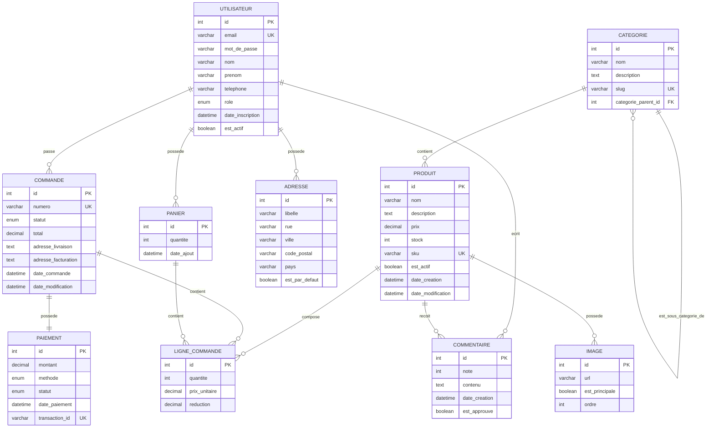
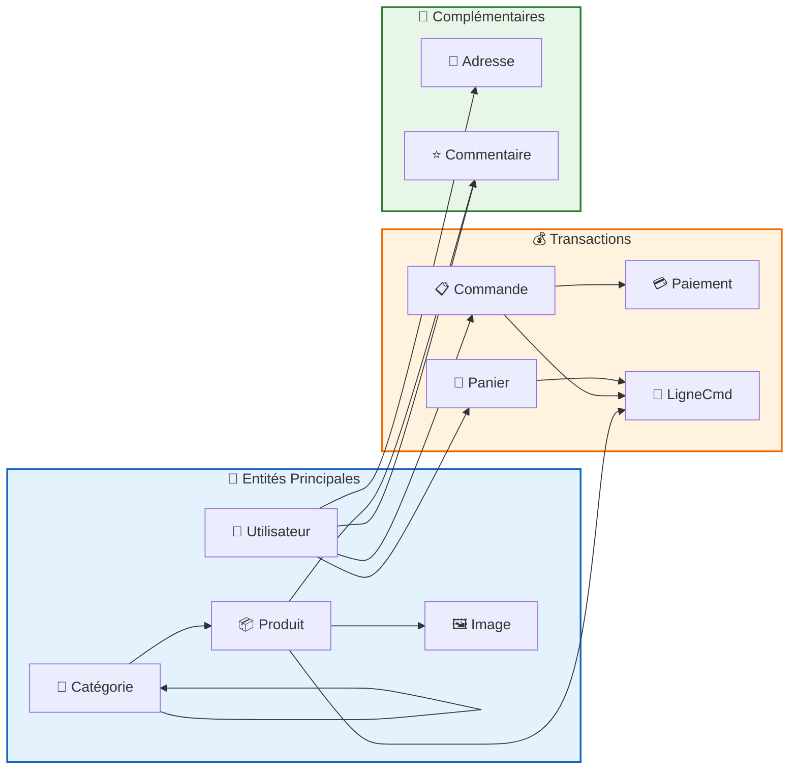

# Modèle Conceptuel de Données (MCD) - KilysCommerce

## Schéma Entités-Associations

---

## Schéma simplifié des relations

---

## Récapitulatif des Cardinalités

| Relation | Cardinalité Min | Cardinalité Max | Description |
|----------|-----------------|------------------|-------------|
| Utilisateur → Panier | 0 | * | Un utilisateur peut avoir plusieurs paniers |
| Utilisateur → Commande | 0 | * | Un utilisateur peut passer plusieurs commandes |
| Utilisateur → Adresse | 0 | * | Un utilisateur peut avoir plusieurs adresses |
| Utilisateur → Commentaire | 0 | * | Un utilisateur peut écrire plusieurs avis |
| Produit → Image | 0 | * | Un produit peut avoir plusieurs images |
| Produit → Commentaire | 0 | * | Un produit peut recevoir plusieurs avis |
| Produit → LigneCommande | 0 | * | Un produit peut être dans plusieurs lignes |
| Catégorie → Produit | 0 | * | Une catégorie peut contenir plusieurs produits |
| Catégorie → Catégorie | 0 | * | Une catégorie peut avoir des sous-catégories |
| Commande → Paiement | 1 | 1 | Une commande possède un seul paiement |
| Commande → LigneCommande | 1 | * | Une commande contient plusieurs lignes |
| Panier → LigneCommande | 0 | * | Un panier contient plusieurs lignes |

